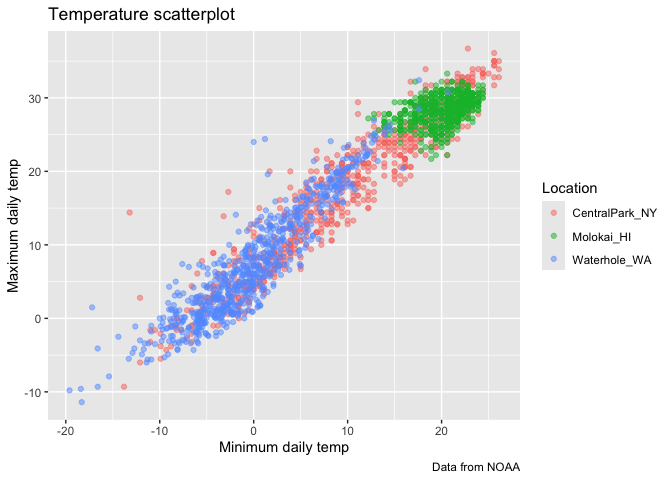
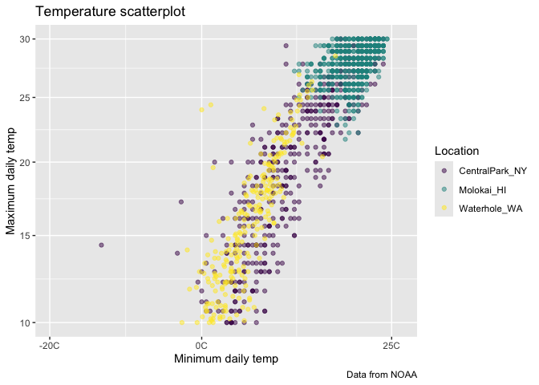

Viz II
================

Import weather data

``` r
data("weather_df")
```

Let’s make our basic scatterplot

``` r
weather_df |> 
  ggplot(aes(x = tmin, y = tmax)) +
  geom_point(aes(color = name), alpha = 0.5) +
  labs(
    x = "Minimum daily temp", # update x axis
    y = "Maximum daily temp", # update y axis
    title = "Temperature scatterplot", # update title
    caption = "Data from NOAA", # add caption
    color = "Location" # update legend title 
  )
```

    ## Warning: Removed 17 rows containing missing values or values outside the scale range
    ## (`geom_point()`).

<!-- -->

## Scales

``` r
weather_df |> 
  #filter(tmax > 10, tmax < 30) |> 
  ggplot(aes(x = tmin, y = tmax)) +
  geom_point(aes(color = name), alpha = 0.5) +
  labs(
    x = "Minimum daily temp", # update x axis
    y = "Maximum daily temp", # update y axis
    title = "Temperature scatterplot", # update title
    caption = "Data from NOAA", # add caption
    color = "Location" # update legend title 
  ) +
  scale_x_continuous( # want to change something on x axis and its continuous
    breaks = (c(-20, 0, 25)), 
    labels = c("-20C", "0C", "25C")
  ) +
  scale_y_continuous(
    trans = "sqrt", # square root transformation
    limits = c(10, 30)
  ) +
  #scale_color_hue(h = c(100, 300)) # change color palette in background, but don't do this! 
  viridis::scale_color_viridis(
    discrete = TRUE
  )
```

    ## Warning in transformation$transform(x): NaNs produced

    ## Warning in scale_y_continuous(trans = "sqrt", limits = c(10, 30)): sqrt
    ## transformation introduced infinite values.

    ## Warning: Removed 843 rows containing missing values or values outside the scale range
    ## (`geom_point()`).

<!-- -->
