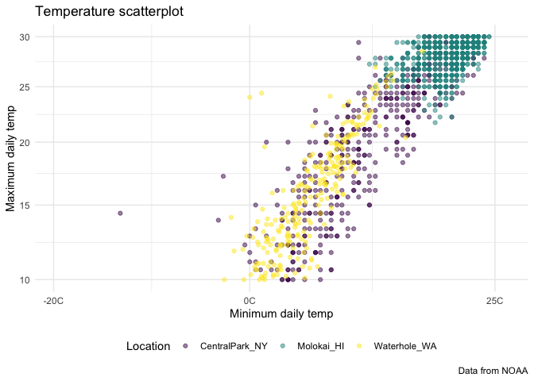
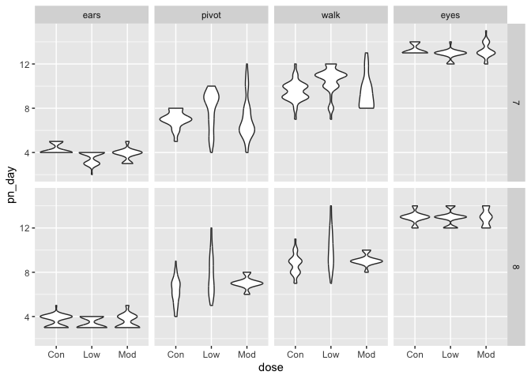

Viz II
================

Import weather data

``` r
data("weather_df")
```

Let’s make our basic scatterplot

``` r
weather_df |> 
  ggplot(aes(x = tmin, y = tmax)) +
  geom_point(aes(color = name), alpha = 0.5) +
  labs(
    x = "Minimum daily temp", # update x axis
    y = "Maximum daily temp", # update y axis
    title = "Temperature scatterplot", # update title
    caption = "Data from NOAA", # add caption
    color = "Location" # update legend title 
  )
```

    ## Warning: Removed 17 rows containing missing values or values outside the scale range
    ## (`geom_point()`).

<!-- -->

## Scales

``` r
weather_df |> 
  #filter(tmax > 10, tmax < 30) |> 
  ggplot(aes(x = tmin, y = tmax)) +
  geom_point(aes(color = name), alpha = 0.5) +
  labs(
    x = "Minimum daily temp", # update x axis
    y = "Maximum daily temp", # update y axis
    title = "Temperature scatterplot", # update title
    caption = "Data from NOAA", # add caption
    color = "Location" # update legend title 
  ) +
  scale_x_continuous( # want to change something on x axis and its continuous
    breaks = (c(-20, 0, 25)), 
    labels = c("-20C", "0C", "25C")
  ) +
  scale_y_continuous(
    trans = "sqrt", # square root transformation
    limits = c(10, 30)
  ) +
  #scale_color_hue(h = c(100, 300)) # change color palette in background, but don't do this! 
  viridis::scale_color_viridis( # color scale, preferred, works in grayscale and for color blindness
    discrete = TRUE 
  )
```

    ## Warning in transformation$transform(x): NaNs produced

    ## Warning in scale_y_continuous(trans = "sqrt", limits = c(10, 30)): sqrt
    ## transformation introduced infinite values.

    ## Warning: Removed 843 rows containing missing values or values outside the scale range
    ## (`geom_point()`).

<!-- -->

## Themes

Make my base plot

``` r
ggplot_temp <- # saves all code in this chunk as object 
  weather_df |> 
  ggplot(aes(x = tmin, y = tmax)) +
  geom_point(aes(color = name), alpha = 0.5) +
  labs(
    x = "Minimum daily temp", 
    y = "Maximum daily temp", 
    title = "Temperature scatterplot", 
    caption = "Data from NOAA", 
    color = "Location" 
  ) +
  scale_x_continuous( 
    breaks = (c(-20, 0, 25)), 
    labels = c("-20C", "0C", "25C")
  ) +
  scale_y_continuous(
    trans = "sqrt", 
    limits = c(10, 30)
  ) +
  viridis::scale_color_viridis( 
    discrete = TRUE 
  ) +
  theme_minimal() +
  theme(legend.position = "bottom")

ggsave("weather_scatterplot.png", ggplot_temp)
```

    ## Saving 7 x 5 in image

    ## Warning in transformation$transform(x): NaNs produced

    ## Warning in scale_y_continuous(trans = "sqrt", limits = c(10, 30)): sqrt
    ## transformation introduced infinite values.

    ## Warning: Removed 843 rows containing missing values or values outside the scale range
    ## (`geom_point()`).

Update my base plot

``` r
ggplot_temp +
  theme_minimal() + # removes outside box 
  #theme_bw() # makes black and white
  theme(legend.position = "bottom")  # moves legend to bottom
```

    ## Warning in transformation$transform(x): NaNs produced

    ## Warning in scale_y_continuous(trans = "sqrt", limits = c(10, 30)): sqrt
    ## transformation introduced infinite values.

    ## Warning: Removed 843 rows containing missing values or values outside the scale range
    ## (`geom_point()`).

<!-- -->

## Adding data in geoms

``` r
central_park_df <-
  weather_df |> 
  filter(name == "CentralPark_NY")

molokai_df <-
  weather_df |> 
  filter(name == "Molokai_HI")

ggplot(data = molokai_df, aes(x = date, y = tmax, color = name)) +
  geom_point() +
  geom_line(data = central_park_df) # use different datasets for different parts of plot 
```

    ## Warning: Removed 1 row containing missing values or values outside the scale range
    ## (`geom_point()`).

<!-- -->

### `patchwork`

Make three plots and combine using patchwork.

``` r
ggp_tmax_tmin <-
  weather_df |> 
  ggplot(aes(x = tmin, y = tmax, color = name)) +
  geom_point(alpha = 0.5) +
  theme(legend.position = "none")

ggp_prec_density <-
  weather_df |> 
  filter(prcp > 0) |> 
  ggplot(aes(x = prcp, fill = name)) +
  geom_density(alpha = 0.5) +
  theme(legend.position = "none")

ggp_temp_season <-
  weather_df |> 
  ggplot(aes(x = date, y = tmax, color = name)) +
  geom_point(alpha = 0.5) +
  geom_smooth(se = FALSE) +
  theme(legend.position = "bottom")

(ggp_tmax_tmin + ggp_prec_density) / ggp_temp_season # add plots together 
```

    ## Warning: Removed 17 rows containing missing values or values outside the scale range
    ## (`geom_point()`).

    ## `geom_smooth()` using method = 'loess' and formula = 'y ~ x'

    ## Warning: Removed 17 rows containing non-finite outside the scale range
    ## (`stat_smooth()`).
    ## Removed 17 rows containing missing values or values outside the scale range
    ## (`geom_point()`).

<!-- -->

## Data manipulation

Let’s make temperature violin plots

``` r
weather_df |> 
  mutate(name = fct_relevel(name, c("Molokai_HI", "CentralPark_NY", "Waterhole_WA"))) |> # releveling factor variable, giving variables these levels, telling specific order it should be in e.g. Molokai = 1, CentralPark = 2, Waterhole = 3
  ggplot(aes(x = name, y = tmax, fill = name)) +
  geom_violin(alpha = 0.5)
```

    ## Warning: Removed 17 rows containing non-finite outside the scale range
    ## (`stat_ydensity()`).

<!-- -->

``` r
weather_df |> 
  mutate(name = fct_reorder(name, tmax)) |> # tell which variable you are reordering and tell it which thing you are reordering with respect to 
  ggplot(aes(x = name, y = tmax, fill = name)) +
  geom_violin(alpha = 0.5)
```

    ## Warning: There was 1 warning in `mutate()`.
    ## ℹ In argument: `name = fct_reorder(name, tmax)`.
    ## Caused by warning:
    ## ! `fct_reorder()` removing 17 missing values.
    ## ℹ Use `.na_rm = TRUE` to silence this message.
    ## ℹ Use `.na_rm = FALSE` to preserve NAs.

    ## Warning: Removed 17 rows containing non-finite outside the scale range
    ## (`stat_ydensity()`).

<!-- -->

What about data tidiness??

``` r
pulse_df <-
  haven::read_sas("data/public_pulse_data.sas7bdat") |> 
  janitor::clean_names() |> 
  pivot_longer(
    bdi_score_bl:bdi_score_12m, 
    names_to = "visit",
    names_prefix = "bdi_score_",
    values_to = "bdi"
  ) |> 
  mutate(visit = fct_inorder(visit)) # orders in order it appears in original dataset 

pulse_df |> 
  ggplot(aes(x = visit, y = bdi)) +
  geom_boxplot()
```

    ## Warning: Removed 879 rows containing non-finite outside the scale range
    ## (`stat_boxplot()`).

<!-- -->

Make a plot for the FAS study

``` r
pups_df <-
  read_csv("data/FAS_pups.csv", na = c("NA", ".", ""), skip = 3) |> 
  janitor::clean_names() |> 
  mutate(
    sex = case_match(
      sex, 
      1 ~ "male", 
      2 ~ "female"
    )
  )
```

    ## Rows: 313 Columns: 6
    ## ── Column specification ────────────────────────────────────────────────────────
    ## Delimiter: ","
    ## chr (1): Litter Number
    ## dbl (5): Sex, PD ears, PD eyes, PD pivot, PD walk
    ## 
    ## ℹ Use `spec()` to retrieve the full column specification for this data.
    ## ℹ Specify the column types or set `show_col_types = FALSE` to quiet this message.

``` r
litters_df <-
  read_csv("data/FAS_litters.csv", na = c("NA", ".", "")) |> 
  janitor::clean_names() |> 
  separate(group, into = c("dose", "tx_day"), sep = 3)
```

    ## Rows: 49 Columns: 8
    ## ── Column specification ────────────────────────────────────────────────────────
    ## Delimiter: ","
    ## chr (2): Group, Litter Number
    ## dbl (6): GD0 weight, GD18 weight, GD of Birth, Pups born alive, Pups dead @ ...
    ## 
    ## ℹ Use `spec()` to retrieve the full column specification for this data.
    ## ℹ Specify the column types or set `show_col_types = FALSE` to quiet this message.

``` r
fas_df <-
  left_join(pups_df, litters_df, by = "litter_number")


fas_df |> 
  select(pd_ears:tx_day) |> 
  pivot_longer(
    pd_ears:pd_walk, 
    names_to = "outcome", 
    names_prefix = "pd_", 
    values_to = "pn_day") |> 
  mutate(outcome = fct_reorder(outcome, pn_day)) |> 
  drop_na() |> 
  ggplot(aes(x = dose, y = pn_day)) +
  geom_violin() +
  facet_grid(tx_day ~ outcome)
```

    ## Warning: There was 1 warning in `mutate()`.
    ## ℹ In argument: `outcome = fct_reorder(outcome, pn_day)`.
    ## Caused by warning:
    ## ! `fct_reorder()` removing 44 missing values.
    ## ℹ Use `.na_rm = TRUE` to silence this message.
    ## ℹ Use `.na_rm = FALSE` to preserve NAs.

<!-- -->
